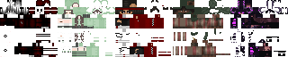
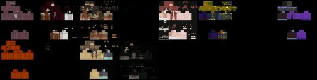
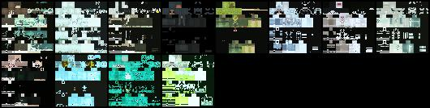
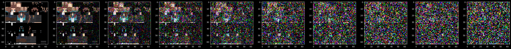
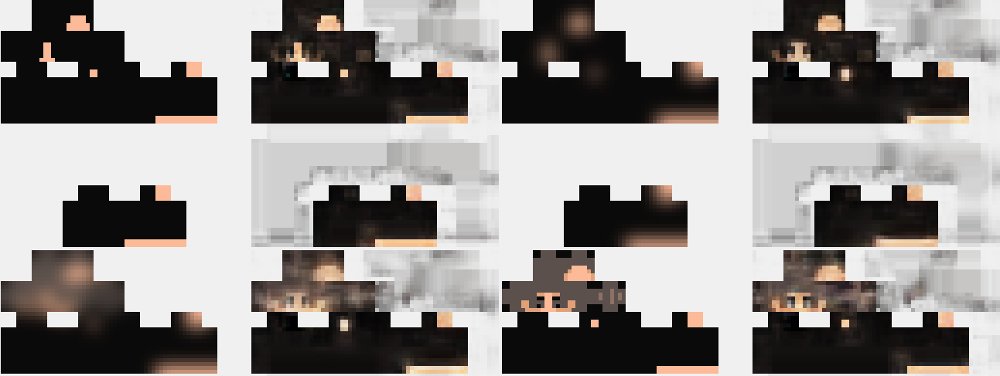
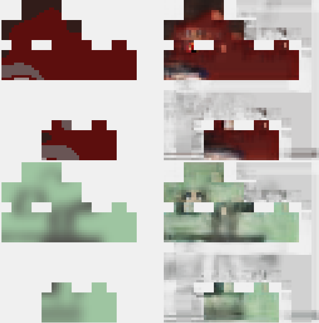
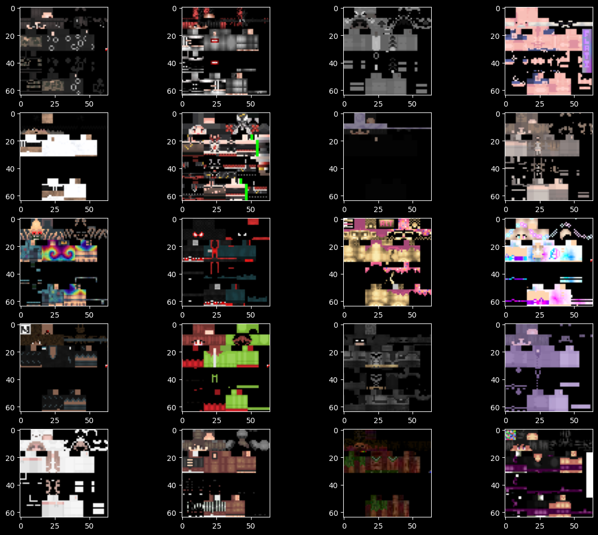
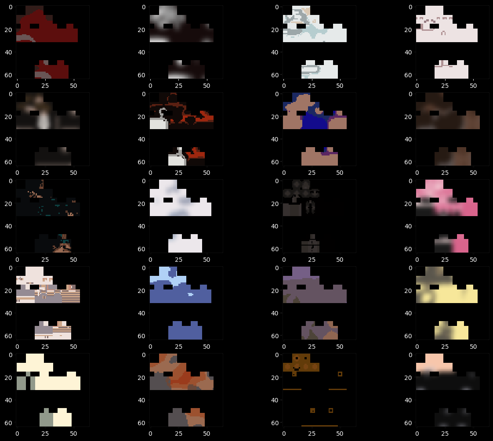

# Minecraft Skin AI

This project generates Minecraft Skins from thin air using AI magic.
There are a few different models in this project, each with their own strengths and weaknesses. 

The best one is the diffusion model.

## Diffusion Model - Pollock

I originally tried to get transparency working with this model but I couldn't get it to run after that. So there is no transparency with this one.

This model is based on [Diffusion Models | PyTorch](https://www.youtube.com/watch?v=TBCRlnwJtZU) [Github](https://github.com/dome272/Diffusion-Models-pytorch/tree/main). Changes were made to the way images were input and proccessed. This is a diffusion model that generates images from noise and doesn't use any keyword inputs. The model is trained on a dataset of about 90,000 Minecraft Skin images. If you want to know more about it check out the (Dataset Section)[#dataset]. This model was trained for 22 epochs for 10 days, with a batch size of 12 (I could have changed this number to make it go faster, I just didn't do much testing because of how long it took). It was trained on a 2080 Ti and took about 11 hours per epoch to train for all 90,000 images. It was trained using the Adam optimizer with the Mean Squared Error loss function. Overall the model has about a 0.0069 loss. 

It is the best model I have trained so far.

To run it you will need to install the following packages:
- `torch` & `torchvision` (Make sure it is the correct version for CuDNN)
- `tqdm` (For progress bars)`
- `matplotlib` (For plotting)
- `numpy` (For math)
- `PIL` (For image processing)

Here are some examples of the images it generates:



Sometimes the image output is entirely black, this could be due to some issues with the preprocessing, but I couldn't find evidence of that. It is most likely because I fiddled with the layers too much.

## Diffusion Model - The La Grande Jatte

This model is based on [Diffusion Models from Scratch in PyTorch](https://www.youtube.com/watch?v=a4Yfz2FxXiY) [Colab](https://colab.research.google.com/drive/1sjy9odlSSy0RBVgMTgP7s99NXsqglsUL). It uses a diffusion model to generate images. The model is trained on a dataset of about 88,000 Minecraft Skin images. I will soon be adding more to the dataset. If you want to know more about it check out the (Dataset Section)[#dataset].

This diffusion model is inside the `trainDiffusionModel.ipynb` file. It is a Jupyter Notebook file so I could get the imbedded plots. You can run it on Google Colab or on your own machine. If you want to run it on your own machine you will need to install the following packages:
- `torch` & `torchvision` (Make sure it is the correct version for CuDNN)
- `tqdm` (For progress bars)`
- `matplotlib` (For plotting)
- `numpy` (For math)
- `PIL` (For image processing)

At the top of the file there is a variable for `IMAGE_FOLDER = "./downloadedskins"` because thats where I kept the 80,000 images. If you want to change the folder you can change it there. You can also change the `BATCH_SIZE` if you need to lower it for your GPU. I used a 2080 Ti and it worked fine with a batch size of 128 and trained at about ~280 images per second.

Nearing the bottom of the file is the training section of code. In there is a variable for `epochs = 500` but you can change it to whatever you want. When training there are some progress bars for each epoch and the loss. After each epoch it will save it to a file in the `The_La_Grande_Jatte/` folder and show a sample image from the current epoch.

WARNING: If you stop the training midway through it will likely leave all the used memory on your GPU. You will need to restart the runtime or restart your computer to get it back. woops

### Diffusion Example Images


## Convolutional Models

There are few different convolutional models in this project. All of them are in the `trainSkinAI.py` file. To run it you will need to install the following packages:
- `tensorflow` (Make sure it is the correct version for CuDNN)
- `numpy` (For math)
- `PIL` (For image processing)

First an overview of the rest of the code: At the top there are some parameters for `input_folder = "./preppedskins"` `output_folder = "./downloadedskins/skins"` you can find out more about theses in the (Dataset Section)[#dataset]. Then there are a few functions to load the dataset from the images in the folders and some code to setup TensorFlow.

Everything after the `with tf.device("/GPU:0"), tf.distribute.OneDeviceStrategy("/GPU:0").scope():` are the models. There is an array `models` so I can test multiple at the same time.


### Model 1 - The Van Gogh Ultima

This model is based on the best out of my 6 initial test models, but with some `BatchNormalization()`. 
```
keras.layers.Conv2D(64, (3, 3), activation="relu", padding="same", input_shape=(image_size[0], image_size[1], 4))
keras.layers.Conv2D(128, (3, 3), activation="relu", padding="same")
keras.layers.BatchNormalization()
keras.layers.Conv2D(256, (3, 3), activation="relu", padding="same")
keras.layers.BatchNormalization()
keras.layers.Conv2D(4, (3, 3), activation="softmax", padding="same")
```
This model was trained using 1 to 1 training images (`expect_multiple_images = False`). It was trained for 100 epochs with a batch size of 32. It was trained on a 2080 Ti and took about 8 hours to train for all 88,000 images. It was trained using the Adam optimizer with the Mean Squared Error loss function. Overall the model has about a 0.68% accuracy and a 0.218 loss. It is not very good, but it is a start.

### Model 2 - The Van Gogh Enigma

This model is based on the one above, but with a lot more layers and a lot more training.
```
keras.layers.Conv2D(64, (3, 3), activation="relu", padding="same", input_shape=(image_size[0], image_size[1], 4))
keras.layers.Conv2D(64, (3, 3), activation="relu", padding="same")
keras.layers.BatchNormalization()
keras.layers.Conv2D(128, (3, 3), activation="relu", padding="same")
keras.layers.Conv2D(128, (3, 3), activation="relu", padding="same")
keras.layers.BatchNormalization()
keras.layers.Conv2D(256, (3, 3), activation="relu", padding="same")
keras.layers.Conv2D(256, (3, 3), activation="relu", padding="same")
keras.layers.BatchNormalization()
keras.layers.Conv2D(128, (3, 3), activation="relu", padding="same")
keras.layers.Conv2D(128, (3, 3), activation="relu", padding="same")
keras.layers.BatchNormalization()
keras.layers.Conv2D(4, (3, 3), activation="softmax", padding="same")
```
This model was trained using 24 to 1 training images (`expect_multiple_images = True`). It was trained for 7 epochs because now I had 2.1 million training images and it took 10 hours. Again it was trained with a batch size of 32 and the Adam optimizer with the Mean Squared Error loss function. Overall the model has about a 0.71% accuracy and a 0.214 loss. It is not much better than the one above, so I decided to try a different approach.

### Convolutional Example Images



Based on these example images you can see why I wanted to try the diffusion model. The convolutional models are not very good at generating images. They are good at generating the same image over and over again, but not good at generating new images. You can see the same face over and over again in the images above. The diffusion model is much better at generating new images.

## Dataset

### Gathering the Dataset

The dataset is a collection of 88,000 Minecraft Skins. I got them from [NameMC](https://www.namemc.com/). I used a web scraper to download all the images from the website. The scraper is in the `getSkins.js` file. Its just a basic NodeJS script to run Puppeteer and go to the [www.namemc.com/minecraft-skins/random](www.namemc.com/minecraft-skins/random) over an over and will save all the skins into the `downloadedskins` folder. I ran it off and on for about a day because I kept getting rate limited. 



### Prepping the Dataset

After I had all the images they needed to be prepped for the models. The prepped images are only used for the convolutional networks because the diffusion model does it's own image prep. To prep the images I did a bunch of things, all in the `prepSkinFiles.py` file. To process the images it loops over all the images in the downloaded skins folder and do the following:
1. Check if the image is 64x64 pixels. If it is not it gets deleted it because I don't want and old style skin files.
2. Grab the alpha  from it and merge it with a `skinmask.png` file. This is so the transparency gets kept from the original skin while removing things outside the skin.
3. Expand the image into all of the transparent parts of the image. 
Then here I split what to do between if it is generating multiple images or not. First the single image generation.
3. Blur the image (this is why I needed to remove the transparent parts in step 3).
4. Qantize the image to reduce the number of colors to a random number between 2 and 5.
5. Add the transparency back to the image.
6. Save the image as a PNG file in the `preppedskins` folder.

For the multiple image generation I do a similar thing to the above:
4. Loop over blur values of [0, 2, 4]
5. Loop over quantize values of [2, 3, 4, 5]
6. Blur and quantize the image.
7. Save the image as a PNG file in the `preppedskins` folder.
8. Blur again and save the image as a PNG file in the `preppedskins` folder.



## Misc Files

### `judgeImages.py`

This will open a tkinter gui that will go through all of the images in the downloaded skins folder and give you the option to delete them or not. This is useful if you want to manually go through the images and delete ones you don't want. 

### `maskDownloadedSkins.py`

This is used to mask the downloaded skins. It will loop over all the images in the downloaded skins folder and mask them to the `skinmask.png` file. This is so the outputs don't have random stuff in the background.

### `testFilesInFolder.py`

This is used to test the files in the prepped skins folder. It will run the first 50 images through the model and show you the results.

### `testWithGUI.py`

This is used to test the model with a tkinter gui. It will open a tkinter gui that will let you draw or pick a file from your computer and run it through the model. It will then show you the results.
